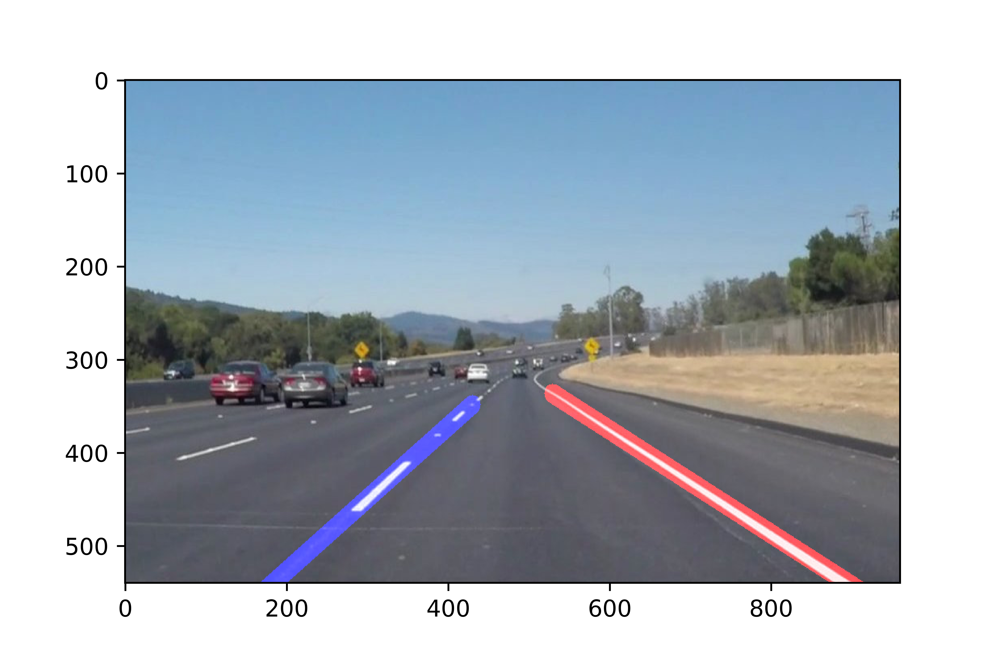

# **Finding Lane Lines on the Road** 

Overview
---

When we drive, we use our eyes to decide where to go.  The lines on the road that show us where the lanes are act as our constant reference for where to steer the vehicle.  Naturally, one of the first things we would like to do in developing a self-driving car is to automatically detect lane lines.

In this project, I have used classical computer vision algorithms to detect lane lines in images and videos. I have used Python and OpenCV for the implementation of these algorithms.

For more details please check out the [the full report](https://github.com/wafarag/Lane-Finding/blob/master/P1%20Lanes%20Finding%20Project%20Report%20ver%202.0.pdf). 
Also, you can check out the source code in the [Jupyter notebook](https://github.com/wafarag/Lane-Finding/blob/master/Lane%2BDetection%2BP1%2Bver%2B2.61.ipynb) or in [HTML format](https://github.com/wafarag/Lane-Finding/blob/master/Lane%2BDetection%2BP1%2Bver%2B2.61.html).
